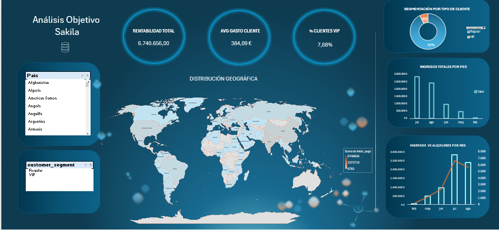

# 🚀 Proyecto ETL & Dashboard BI — Automatización MySQL → Python → Excel

## 📌 Descripción del Proyecto

Este proyecto desarrolla un pipeline ETL automatizado utilizando MySQL, SQL, Python y Excel para extraer, transformar y visualizar datos de la base de datos Sakila. El flujo automatizado permite ejecutar consultas SQL desde Python, generar datasets CSV automáticamente y conectarlos a Excel mediante Power Pivot y tablas dinámicas para construir dashboards interactivos orientados al análisis de negocio y Business Intelligence.

---

# 🎯 Objetivos del Proyecto

- Automatizar la extracción de datos desde MySQL
- Generar datasets CSV preprocesados
- Construir dashboards dinámicos en Excel
- Implementar modelado de datos con Power Pivot
- Analizar KPIs de clientes, ingresos y tendencias temporales
- Crear un flujo automatizado y mantenible

---

# 🗄️ Base de Datos Utilizada

## 📚 Sakila Database (MySQL)

La base de datos Sakila simula un sistema de alquiler de películas e incluye información sobre:

- Clientes
- Pagos
- Alquileres
- Películas
- Categorías
- Ciudades
- Países

---

# 📊 KPIs Analizados

| KPI | Objetivo |
|---|---|
| 👥 Customer Activity | Analizar comportamiento y consumo de clientes |
| 🌍 Geographic Revenue | Analizar ingresos por país y ciudad |
| 📈 Temporal Trends | Analizar tendencias temporales de pagos |
| ⭐ VIP Customers | Detectar clientes VIP y mercados clave |

---

# 📂 Datasets Generados

| Dataset | Descripción |
|---|---|
| `customer_activity.csv` | Actividad y gasto de clientes |
| `temporal_trends.csv` | Tendencias temporales de ingresos |
| `vip_customers.csv` | Ranking y segmentación VIP |
| `2distribucion_geografica.csv` | Distribución geográfica de ingresos |

---

# 🧰 Tecnologías Utilizadas

## 💻 Backend & ETL

- Python
- pandas
- SQLAlchemy
- PyMySQL / mysql-connector-python
- python-dotenv

## 🗄️ Base de Datos

- MySQL
- SQL

## 📊 Business Intelligence

- Excel
- Power Pivot
- Tablas dinámicas

## ⚙️ Dev Tools

- Git
- GitHub
- VS Code

---

# 🔄 Flujo Automatizado

```text
MySQL
   ↓
SQL Queries
   ↓
Python ETL
   ↓
CSV Automáticos
   ↓
Excel + Power Pivot
   ↓
Dashboard Interactivo
```

---

# 📈 Dashboard Final

El dashboard fue construido utilizando Power Pivot, tablas dinámicas y visualizaciones dinámicas en Excel para analizar:

- Revenue total
- Clientes VIP
- Ingresos por país
- Tendencias mensuales
- Clientes más activos
- Mercados más rentables

---

# 📸 Dashboard Preview





---

# ▶️ Cómo Ejecutar el Proyecto

## 1️⃣ Crear entorno virtual

```bash
python -m venv .venv
```

## 2️⃣ Activar entorno virtual

### Mac/Linux

```bash
source .venv/bin/activate
```

### Windows

```bash
.venv\Scripts\activate
```

---

## 3️⃣ Instalar dependencias

```bash
pip install -r requirements.txt
```

---

## 4️⃣ Configurar `.env`

```env
DB_USER=tu_usuario
DB_PASSWORD=tu_password
DB_HOST=localhost
DB_NAME=sakila
```

---

## 5️⃣ Ejecutar ETL

```bash
python3 main.py
```

---

# 📂 Resultado Esperado

```text
output/

├── customer_activity.csv
├── temporal_trends.csv
├── vip_customers.csv
└── 2distribucion_geografica.csv
```

---

# 🚀 Mejoras Futuras

- Integración con Power BI
- Automatización cloud
- Programación automática ETL
- APIs externas
- Visualizaciones avanzadas

---

# 👥 Trabajo en Equipo

Proyecto desarrollado utilizando Git, GitHub y control de versiones colaborativo para organizar tareas de SQL, ETL y visualización BI.

---

# ⭐ Conclusión

Este proyecto demuestra cómo integrar SQL, Python y Excel en un pipeline automatizado orientado a Data Analytics y Business Intelligence, transformando datos relacionales en dashboards dinámicos y automatizados.
